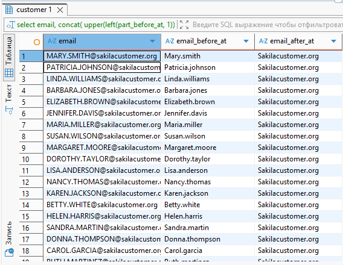

# Домашнее задание к занятию Работа с данными (DDL/DML) - Борзенков Валерий

---

### Задание 1
`select distinct district 
from sakila.address
where district like 'K%a' 
and district not like '% %';` - distinct для удаления дубликатов, если получить все, с учетом дубликатов, то без distinct

---

### Задание 2

`select *
from sakila.payment
where payment_date >= '2005-06-15'
	and payment_date <= '2005-06-18'
	and amount > 10.00;`

---

### Задание 3
`select *
from sakila.rental
order by rental_id desc
limit 5;`

---

### Задание 4
`select customer_id,
replace(lower(first_name), 'll', 'pp') as first_name,
lower(last_name) as last_name,
email,
active
from sakila.customer
where active = 1
and first_name in ('Kelly', 'Willie');`

---

### Задание 5
`select 
	email,
	left(email, position('@' in email)-1) as email_before_at,
	right(email, CHAR_LENGTH(email) - position('@' in email)) as email_after_at
from sakila.customer`

---

### Задание 6
`select
	email,
	concat(
		upper(left(part_before_at, 1)),
		lower(substring(part_before_at, 2))
	) as email_before_at,
	concat(
		upper(left(part_after_at, 1)),
		lower(substring(part_after_at, 2))
	) as email_after_at
from (
	select
			email,
			left(email, position('@' in email)-1) as part_before_at,
			right(email, CHAR_LENGTH(email) - position('@' in email)) as part_after_at
		from sakila.customer
) as parts;
`
