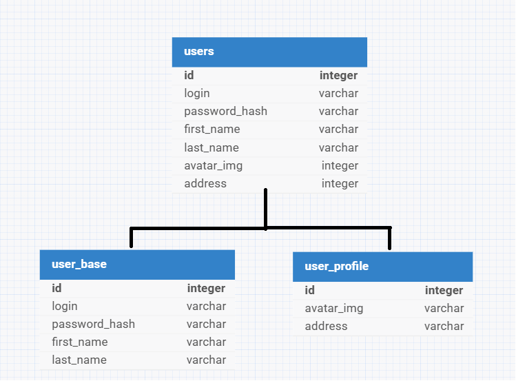
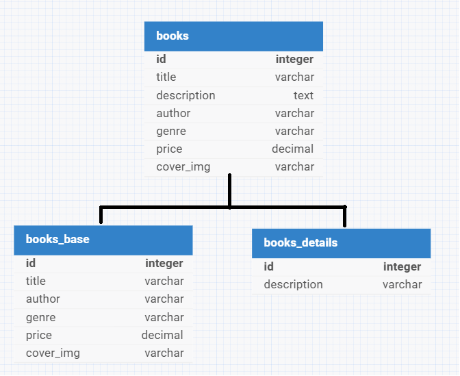
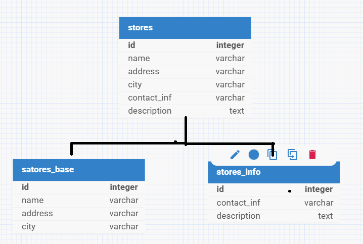
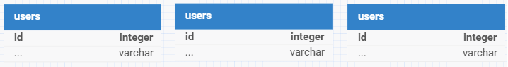
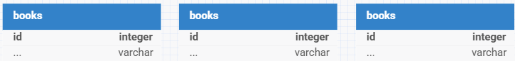
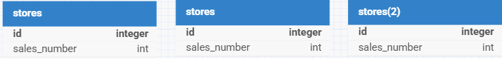

# Домашнее задание к занятию "Расширенные возможности SQL" - Борзенков Валерий

---

### Задание 1

активный master-сервер и пассивный репликационный slave-сервер - преимущество в отказоустойчивости, если основной сервер вышел из строя, можно переключиться на slave и время простоя сократится. нет потери данных, т.к на слейве присутствуют актуальные копии данных.\

master-сервер и несколько slave-серверов - мастер как и в предыдущей версии принимает все операции, а slave обрабатывают запросы чтения, но т.к их несколько, происходит распределение нагрузки, т.к зачастую операций на чтение больше чем на запись, то это снижает нагрузку увеличивая пропускную способность.Так же еще дополнительно нашел информацию, что можно выделить один slave на аналитику, не замедляя работу пользователей. Единственное если взять как за минус "задержку" данных, на slave могут быть данные немного устаревшими.

---

### Задание 2

### Вертикальный шардлинг

**users_base** - основные данные \
**users_profile** - данные подтягивающиеся при необходимости

**books_base** - основные данные для отображения книги в списке \
**books_details** - данные подтягивающиеся при подробной информации

**stores_base** - основные данные для отображения в списке \
**stores_info** - детальные данные о магазине

### Горизонтальный шардлинг

Ключи шардирования:

Таблица **users** - ключ **id(user_id)** \
Таблица **books** - ключ **id(book_id)** \
Таблица **stores** - ключ **city** 

Способы шардирования:

`shard_id = hash(user_id) % num_shards`

`shard_id = hash(book_id) % num_shards`

`shard_id = sum_sales / sales_number * 100`