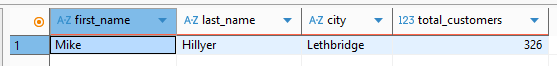

# Домашнее задание к занятию Работа с данными (DDL/DML) - Борзенков Валерий

---

### Задание 1

`select
	s.first_name,
	s.last_name,
	c.city,
	customer_count.total_customers
from (
	select
		store_id,
		count(*) as total_customers
	from sakila.customer
	group by store_id
	having count(*) > 300
) as customer_count
join sakila.staff s on s.store_id = customer_count.store_id
join sakila.store st on st.store_id = customer_count.store_id
join sakila.address a on a.address_id = st.address_id
join sakila.city c on c.city_id = a.city_id;`

---

### Задание 2

``

---

### Задание 3

``

---

### Задание 4

``

---

### Задание 5

``

---
