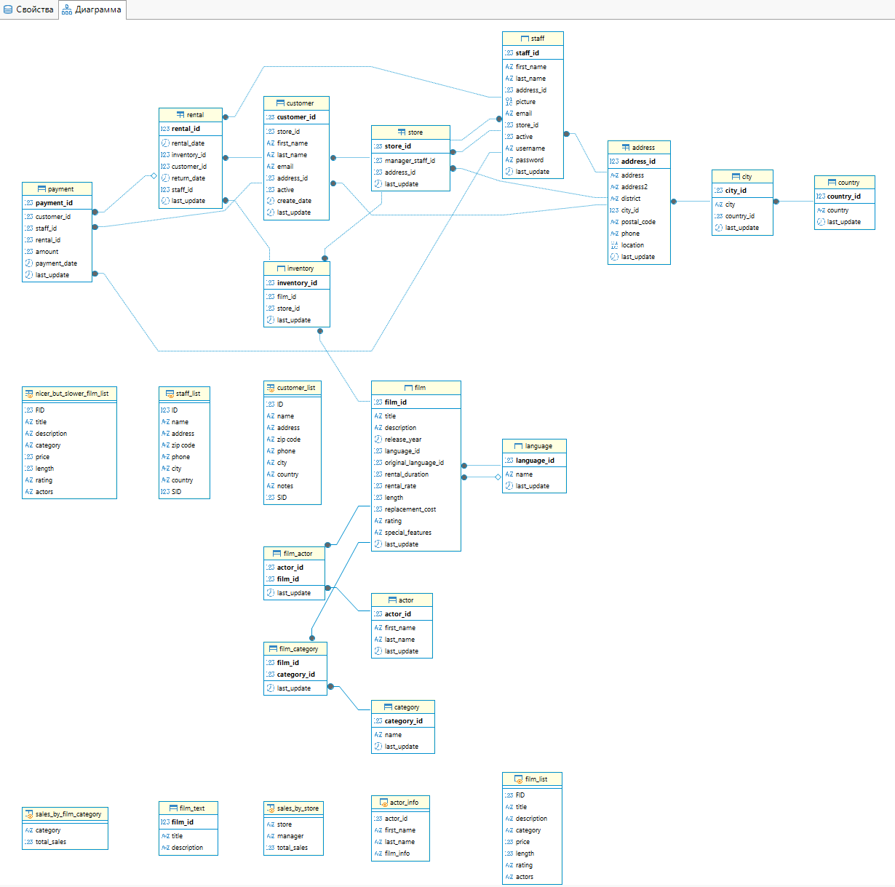
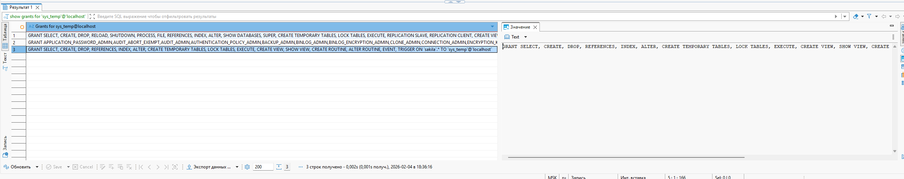

# Домашнее задание к занятию Работа с данными (DDL/DML) - Борзенков Валерий

---

### Задание 1

1. `
create user 'sys_temp'@'localhost' identified by 'password';`
2. `select user from mysql.user;` 
3. `grant all privileges on *.* to 'sys_temp'@'localhost';`
4. `show grants for 'sys_temp'@'localhost';`
5. 

---

### Задание 2

| Название таблицы | Название первичного ключа |
|------------------|---------------------------|
| actor            | actor_id                  |
| address          | address_id                |
| category         | category_id               |
| city             | city_id                   |
| country          | country_id                |
| customer         | customer_id               |
| film             | film_id                   |
| film_actor       | actor_id, film_id         |
| film_category    | film_id, category_id      |
| film_text        | film_id                   |
| inventory        | inventory_id              |
| film_category    | film_id, category_id      |
| language         | language_id               |
| payment          | payment_id                |
| rental           | rental_id                 |
| staff            | staff_id                  |
| store            | store_id                  |

---

### Задание 3

`Приведите ответ в свободной форме........`

1. `revoke insert, update, delete on sakila.* from 'sys_temp'@'localhost';`
2. 

